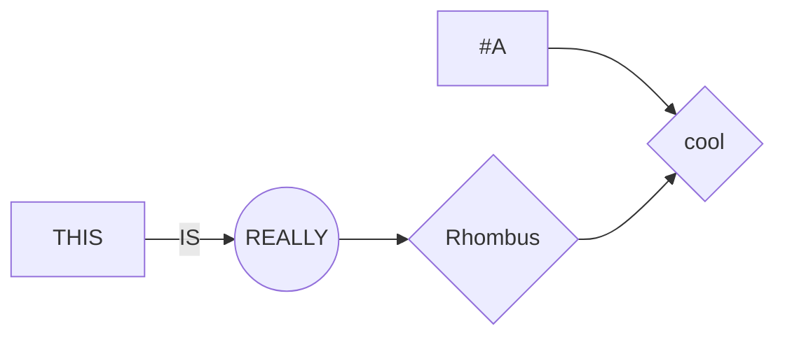

# CMPE 491/691 PROJECT REPOSITORY

  

## FOLDERS

1. hw1proj

>  **VERILOG** Vigenere Encryption / Decryption / Cracking

2. hardwaresecurity1

>  **C#** Random Utility for making verilog faster

3. RelativeLetterFrequencies

>  **C#** Vigenere Cracking Statistical Attack

4. AESEncryption

>  **VERILOG** Vivado project that performs AES Encryption

5. DFAAES

>  **C#** Giraud Differential Fault Attack program

6. EuclideanAlgorithmCalculator

>  **C++** Extended Eucledian Algorithm

7. TrojanDetectionCCAnalysis

>  **C#** Trojan Detection and Analysis (Hardware trojan detection)

8. CMPE491_HW7_MODELSIM
 

## Git Description

Project Git Description

```bash
I made this repo so I don't lose my progress on my code
```

I am just gonna leave this here


